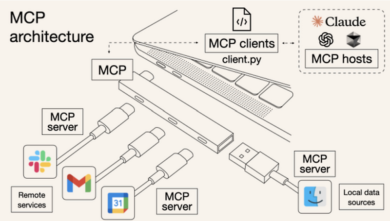

# IntelliJ IDEA + claude MCP 예제 프로젝트

## 사전 준비
1. node.js 설치
   - https://nodejs.org/ko/download
1. Claude Desktop
   - https://claude.ai/download
2. IntelliJ IDEA
   - https://www.jetbrains.com/ko-kr/idea/download/other.html
   - 메모리 사용을 많이하여 IntelliJ IDEA 설정 필요 
3. MCP jetbrains
   - https://github.com/JetBrains/mcp-jetbrains

```
{
  "mcpServers": {
    "jetbrains": {
      "command": "npx",
      "args": ["-y", "@jetbrains/mcp-proxy"]
    }
  }
}
```

### MCP github
- https://github.com/modelcontextprotocol/servers

## MCP란?
<br>

2024년 11월, Anthropic이 Model Context Protocol(MCP)을 오픈 소스로 공개하였지만 당시에는 큰 주목을 받지 못했습니다. 그러나 2025년 초부터 MCP에 대한 관심이 급증하고 있는데, 이러한 변화의 주요 요인 중 하나는 AI 에이전트와 에이전틱 워크플로우의 발전에 따라, 실제 비즈니스 시스템과 데이터를 AI 에이전트에 통합하는 필요성이 대두되었기 때문입니다. MCP는 이러한 통합 문제를 해결하는 표준으로서, 파일 시스템, 데이터베이스, API 등 기존 데이터 소스를 AI 워크플로우에 연결하는 방법을 정의하여, 생산 준비가 된 AI 에이전트를 구축하는 데 필수적인 요소로 부상하였습니다.

### Cursor AI 덕분에 상승
MCP도 처음부터 흥하지는 않았습니다. MCP가 이슈로 떠오른 건 ‘커서(Cursor)’라는 AI 코딩 편집기에서 MCP를 지원하기 시작하면서부터 였습니다.

### openAI도 가세
2025년 3월 27일, 오픈AI의 CEO인 샘 알트만은 오픈AI가 자사 제품 전반에 MCP 지원을 추가한다고 밝혔습니다. 사실 앤트로픽이 MCP를 발표할 때만 해도 많은 이들이 ‘경쟁자인 오픈AI가 안 따라줄 텐데?’라고 생각했는데, 모두의 예상을 뒤엎었습니다.
 - 이제는 MCP가 AI 산업 표준

## MCP는 무엇?
<br>

MCP는 "대규모 언어 모델이 외부 데이터와 시스템을 더 효과적으로 활용할 수 있도록 설계된 일종의 연결 프로토콜"입니다. 앤트로픽은 MCP를 USB-C 포트에 비유합니다. USB-C가 다양한 기기와 주변 장치를 표준화된 방식으로 연결하듯이, MCP는 AI 모델이 다양한 데이터 소스와 도구에 표준화된 방식으로 연결될 수 있게 해줍니다.

### MCP가 더 발전하면?
- 슬랙에 내 업무 분석해서, 노션에 태스크 정리하고 담당자들에게 메일 보내

<br>

### figma 예시
<br>


## 실전 Claude + IntelliJ MCP로 연동 후 투두 리스트 만들기

### ✅ 1단계. 투두 리스트 CRUD 서버 개발 (Spring Boot + JPA + H2)

Claude 에게 시킬 프롬포트
```
# 역할
너는백엔드 개발자야. 내가 요청한 기능에 맞게 Spring Boot 기반의 코드를 작성해줘.

# 기술 스택
Spring Boot 3.x, Spring Web, Spring Data JPA, H2DB

# 요구사항
1. Todo Entity는 title, description, isDone 필드를 갖는다.
2. title은 필수이며, description은 선택, isDone은 기본값 false.
3. 투두를 등록(Create), 전체 조회(Read), 단건 조회(Read), 수정(Update), 삭제(Delete)하는 REST API를 만들어줘.
4. 각 기능에 맞는 DTO, Service, Controller를 작성해줘.
5. Repository는 JpaRepository로 만들어줘.
6. 테스트 코드는 나중에 따로 요청할게.
```

### ✅ 2단계. Thymeleaf + HTML로 간단한 프론트엔드 개발

Claude 에게 시킬 프롬포트
```
# 역할
너는 Spring Boot + Thymeleaf를 사용하는 웹 프론트엔드 개발자야.
기존 작성된 서버 코드를 바탕으로 Thymeleaf와 연동을 진행해주면 돼

# 요구사항
1. todo 목록을 보여주는 list.html을 만들어줘.
2. todo 등록 폼을 갖는 create.html을 만들어줘.
3. 등록 폼에는 title, description 입력창과 등록 버튼이 있어야 해.
4. 목록 페이지에서는 체크박스로 완료 처리(isDone 수정)가 가능해야 해.
5. Controller는 @Controller 애노테이션을 사용하고, Model에 데이터 넣어서 view에 전달해줘.
6. thymeleaf 문법은 기본적인 것만 사용해줘.
```

### ✅ 3단계. 세션기반 로그인/ 회원가입 개발

Claude 에게 시킬 프롬포트
```
# 역할
너는 Spring Boot 백엔드 개발자야. 기존에 만든 투두 리스트 서버에 세션 기반 회원가입/로그인 기능을 연동할 거야.
로그인한 사용자만 자신의 투두 목록을 조회, 생성, 수정, 삭제할 수 있게 해줘.

# 현재 상황
- Todo 엔티티는 이미 존재하고, Todo CRUD 기능도 구현되어 있어.
- Thymeleaf 기반의 프론트엔드 (list.html, create.html) 도 구현되어 있어.

# 해야 할 일

## ✅ 회원 관련 기능 추가

1. User Entity 생성
   - email, password (BCrypt로 암호화), nickname 필드
   - email은 유일해야 해.

2. 회원가입 기능 (/signup)
   - Thymeleaf로 signup.html 폼 페이지
   - 중복 이메일은 등록 불가
   - 성공 시 /login으로 리다이렉트

3. 로그인 기능 (/login)
   - Thymeleaf login.html 폼 페이지
   - 로그인 성공 시 세션에 사용자 정보 저장
   - 실패 시 오류 메시지 표시

4. 로그아웃 기능 (/logout)
   - 세션 무효화 후 /login으로 이동

## ✅ 투두 기능과 사용자 연동

1. Todo 엔티티에 User (ManyToOne) 연관관계 추가
2. 로그인한 사용자만 자신의 투두를 조회/등록/수정/삭제 가능하게 수정
3. 투두 생성 시 현재 로그인한 사용자를 Todo의 주인으로 설정
4. 컨트롤러에서 세션을 통해 로그인 유저 정보를 가져오고, 해당 유저의 투두만 처리

## ✅ Thymeleaf 연동

- 로그인된 유저의 닉네임을 list.html에 출력해줘
- 로그인하지 않은 사용자가 /todos 등에 접근하면 /login으로 리다이렉트
```